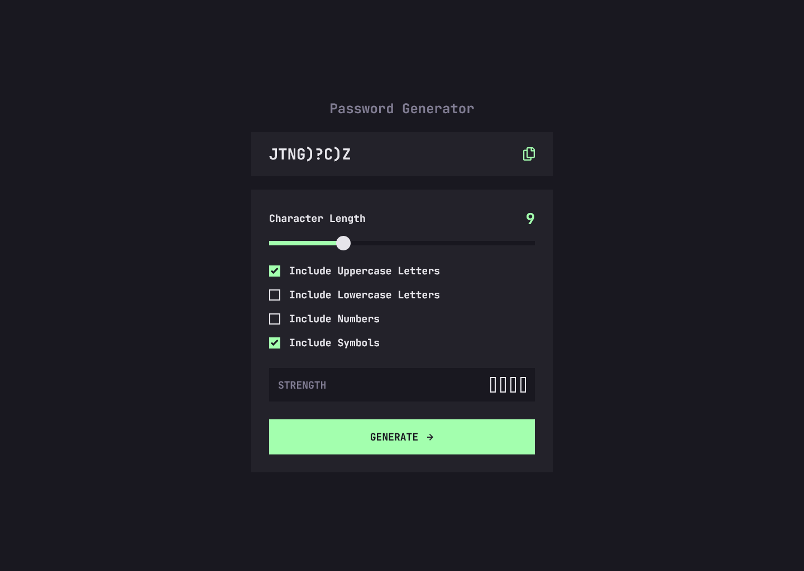

# Password-Generator

## Table of contents

- [Password-Generator](#password-generator)
  - [Table of contents](#table-of-contents)
  - [Overview](#overview)
    - [The challenge](#the-challenge)
    - [Screenshot](#screenshot)
      - [Mobile View](#mobile-view)
      - [Tablet View](#tablet-view)
      - [Desktop View](#desktop-view)
    - [Links](#links)
  - [My process](#my-process)
    - [Built with](#built-with)

## Overview

### The challenge

Users should be able to:

- Generate a password based on the selected inclusion options
- Copy the generated password to the computer's clipboard
- See a strength rating for their generated password
- View the optimal layout for the interface depending on their device's screen size
- See hover and focus states for all interactive elements on the page

### Screenshot

#### Mobile View

#### Tablet View

#### Desktop View

### Links

- [Solution URL](https://your-solution-url.com)
- [Live Site URL](https://www.frontendmentor.io/challenges/password-generator-app-Mr8CLycqjh/hub)

## My process

### Built with

- Semantic HTML5 markup
- CSS3
- Flexbox
- CSS Grid
- Vanilla JS